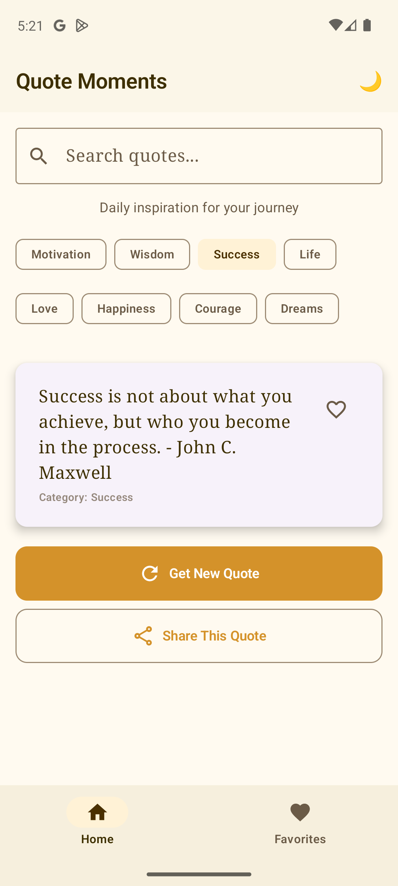
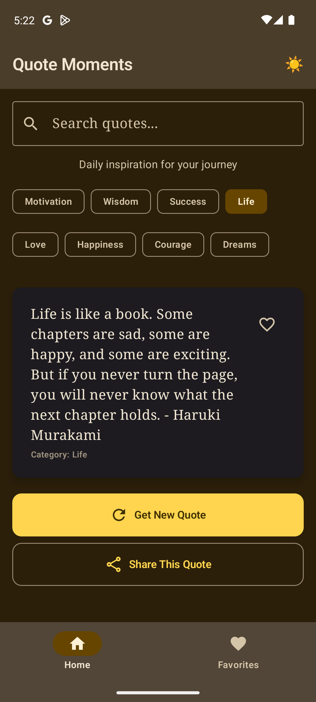
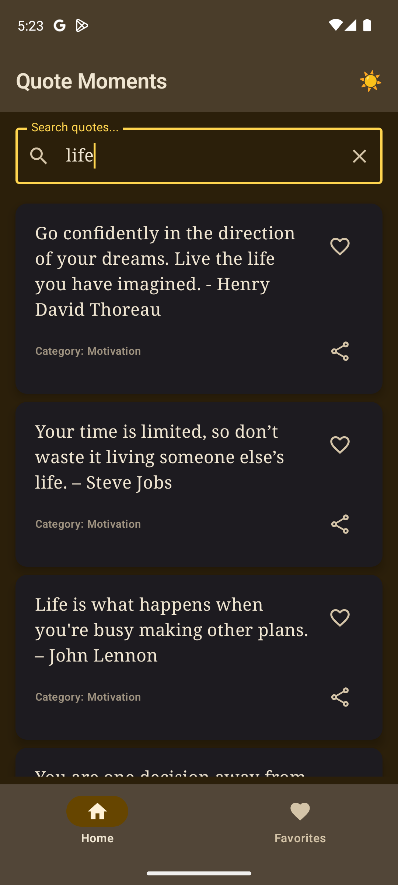
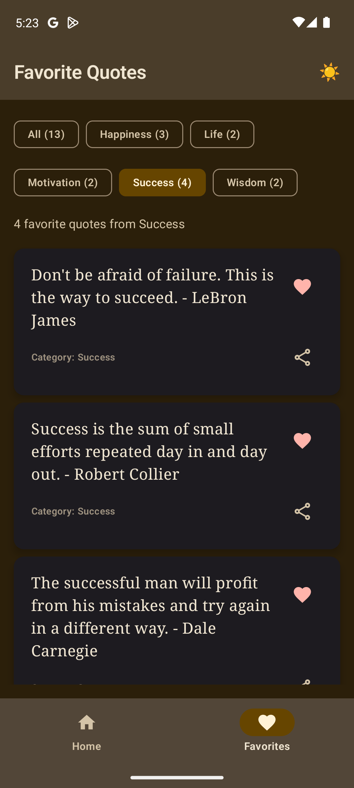

# QuoteMoments 📝✨

A beautiful and inspiring quotes application built with **Jetpack Compose** following modern Android development best
practices. Get daily inspiration through curated quotes from various categories with a clean, Material 3 design.

## 🌟 Features

- **📚 Browse Quotes by Category**: Explore quotes from different categories like motivation, success, life, and more
- **🎲 Random Quote Generation**: Get a new inspiring quote with the tap of a button
- **🔍 Real-time Search**: Search through all quotes to find specific content or topics
- **❤️ Favorites System**: Save your favorite quotes for quick access later
- **🏷️ Smart Filtering**: Filter your favorites by category with count badges
- **📤 Share Quotes**: Share inspiring quotes with friends via any messaging app
- **🌓 Dark/Light Theme**: Toggle between themes with persistent preference
- **📴 Offline First**: All quotes stored locally for instant access without internet

## 📱 Screenshots

|                              Light Mode                               |                              Dark Mode                               |                              Search                               |                              Favorites                               |
|:---------------------------------------------------------------------:|:--------------------------------------------------------------------:|:-----------------------------------------------------------------:|:--------------------------------------------------------------------:|
|  |  |  |  |

## 🛠️ Tech Stack

### Core

- **UI Framework**: [Jetpack Compose](https://developer.android.com/jetpack/compose) (BOM 2026.01.01)
- **Language**: Kotlin 2.3.0
- **Material Design**: Material 3 (1.4.0)
- **Min SDK**: 24 (Android 7.0)
- **Target SDK**: 35 (Android 15)

### Architecture & Libraries

- **Architecture Pattern**: MVVM with Repository pattern
- **State Management**: StateFlow & collectAsStateWithLifecycle
- **Lifecycle**: Lifecycle Runtime KTX 2.10.0
- **Coroutines**: Kotlin Coroutines for async operations
- **Data Storage**:
    - Local JSON file for quotes database
    - SharedPreferences for user preferences (favorites, theme)

### Modern Jetpack Components

- `androidx.lifecycle.ViewModel` - State management
- `androidx.lifecycle.compose.collectAsStateWithLifecycle` - Lifecycle-aware state collection
- `androidx.compose.runtime.derivedStateOf` - Optimized computed states
- `androidx.compose.runtime.saveable.rememberSaveable` - Configuration change handling

## 📁 Project Structure

```
app/src/main/
├── java/com/quotemoments/
│   ├── MainActivity.kt                           # Entry point with theme & navigation event handling
│   │
│   ├── data/
│   │   ├── model/
│   │   │   └── Quote.kt                         # Data models (Quote, QuoteData)
│   │   ├── repository/
│   │   │   └── QuoteRepository.kt               # Handles quote loading & search logic
│   │   └── local/
│   │       └── PreferencesManager.kt            # SharedPreferences wrapper for favorites & theme
│   │
│   └── ui/
│       ├── QuoteViewModel.kt                     # ViewModel with StateFlow for state management
│       ├── QuoteUiState.kt                       # UI state & events (sealed interfaces)
│       │
│       ├── screens/
│       │   ├── QuoteApp.kt                      # Main scaffold with top bar & bottom navigation
│       │   ├── HomeScreen.kt                    # Home screen with quotes & search
│       │   └── FavoritesScreen.kt               # Favorites screen with category filtering
│       │
│       ├── components/
│       │   ├── QuoteCard.kt                     # Reusable quote card component
│       │   ├── SearchBar.kt                     # Search input with clear button
│       │   ├── CategoryChips.kt                 # Category filter chips (home)
│       │   ├── CurrentQuoteCard.kt              # Main quote display card
│       │   ├── QuoteActionButtons.kt            # New quote & share buttons
│       │   └── FavoriteCategoryChips.kt         # Category filter chips (favorites)
│       │
│       └── theme/
│           ├── Color.kt                         # Custom color palette for light/dark themes
│           ├── Theme.kt                         # Material 3 theme configuration
│           └── Type.kt                          # Typography definitions
│
├── assets/
│   └── quotes.json                              # Local quotes database (JSON format)
│
└── res/
    ├── values/
    │   ├── strings.xml                          # String resources
    │   ├── colors.xml                           # Color resources
    │   └── themes.xml                           # Material themes
    ├── drawable/                                # Vector drawables & icons
    └── mipmap/                                  # App launcher icons
```

## 🏗️ Architecture

### MVVM with Clean Architecture Principles

```
┌────────────────────────────────────────────────────────────┐
│                         UI Layer                           │
│  ┌────────────────┐  ┌──────────────┐  ┌────────────────┐  │
│  │   Composables  │──│  ViewModel   │──│   UI State     │  │
│  │   (Screens &   │  │ (StateFlow)  │  │ (Data Class)   │  │
│  │   Components)  │  └──────────────┘  └────────────────┘  │
│  └────────────────┘                                        │
└────────────────────────────────────────────────────────────┘
                              │
                              ▼
┌────────────────────────────────────────────────────────────┐
│                       Domain Layer                         │
│  ┌────────────────┐         ┌────────────────┐             │
│  │   Repository   │         │     Events     │             │
│  │   (Business    │         │   (Sealed      │             │
│  │    Logic)      │         │   Interface)   │             │
│  └────────────────┘         └────────────────┘             │
└────────────────────────────────────────────────────────────┘
                              │
                              ▼
┌────────────────────────────────────────────────────────────┐
│                        Data Layer                          │
│  ┌─────────────────┐        ┌─────────────────┐            │
│  │  Preferences    │        │   JSON Asset    │            │
│  │   Manager       │        │  (quotes.json)  │            │
│  └─────────────────┘        └─────────────────┘            │
└────────────────────────────────────────────────────────────┘
```

### Key Architectural Decisions

✅ **Unidirectional Data Flow (UDF)**

- Events flow up from UI to ViewModel
- State flows down from ViewModel to UI
- Single source of truth for app state

✅ **Repository Pattern**

- Centralized data operations
- Abstracts data sources from ViewModel
- Easy to test and modify

✅ **ViewModel with StateFlow**

- Lifecycle-aware state management
- Survives configuration changes
- Reactive UI updates

✅ **Component-Based UI**

- Small, reusable composables
- Single responsibility principle
- Easy to test and maintain

✅ **Performance Optimizations**

- `derivedStateOf` for computed values
- `rememberSaveable` for configuration changes
- Stable keys in LazyColumn for smooth scrolling
- Remembered callbacks to prevent recreations

## 🎯 Key Features Explained

### State Management

```kotlin
// ViewModel exposes StateFlow
val uiState: StateFlow<QuoteUiState>

// UI collects with lifecycle awareness
val uiState by viewModel.uiState.collectAsStateWithLifecycle()

// Events sent to ViewModel
viewModel.onEvent(QuoteEvent.ToggleFavorite(quote))
```

### Search Implementation

```kotlin
// Real-time filtering with derivedStateOf
val filteredQuotes by remember(searchQuery, quoteData) {
    derivedStateOf {
        repository.searchQuotes(searchQuery, quoteData)
    }
}
```

### Navigation Events

```kotlin
// One-time events using SharedFlow
val navigationEvents = viewModel.navigationEvents.asSharedFlow()

// Collected in MainActivity
LaunchedEffect(Unit) {
    viewModel.navigationEvents.collectLatest { event ->
        when (event) {
            is NavigationEvent.ShareQuote -> shareQuote(event.quote)
        }
    }
}
```

## 🚀 Getting Started

### Prerequisites

- **Android Studio**: Ladybug | 2024.2.1 or newer
- **JDK**: 17 or higher
- **Android SDK**: 24+ (API level 24 - Android 7.0 or higher)
- **Gradle**: 8.x (managed by wrapper)

### Installation

1. **Clone the repository**

```bash
   git clone https://github.com/vipulshah2010/QuoteMoments.git
   cd QuoteMoments
```

2. **Open in Android Studio**
    - Launch Android Studio
    - Select "Open an existing Android Studio project"
    - Navigate to the cloned repository and select the root folder
    - Wait for Gradle sync to complete

3. **Add your quotes** (Optional)
    - Edit `app/src/main/assets/quotes.json`
    - Follow the existing JSON structure:

```json
   {
  "quotes": {
    "your_category": [
      "Your inspiring quote here",
      "Another quote in the same category"
    ]
  }
}
```

4. **Build and run**
    - Connect an Android device (API 24+) or start an emulator
    - Click the "Run" button (▶️) or press `Shift + F10`
    - Select your device and wait for installation

### Building Release APK

```bash
# Debug build
./gradlew assembleDebug

# Release build (requires signing config)
./gradlew assembleRelease

# Install on connected device
./gradlew installDebug
```

## 📄 Data Format

### Quotes JSON Structure

Location: `app/src/main/assets/quotes.json`

```json
{
  "quotes": {
    "motivation": [
      "The only way to do great work is to love what you do.",
      "Believe you can and you're halfway there."
    ],
    "success": [
      "Success is not final, failure is not fatal.",
      "The road to success is always under construction."
    ],
    "life": [
      "Life is what happens when you're busy making other plans.",
      "In the end, we only regret the chances we didn't take."
    ]
  }
}
```

### SharedPreferences Storage

```kotlin
// Theme preference
"is_dark_theme" -> Boolean

// Favorites (JSON array)
"favorites" -> [
{
    "text": "Quote text",
    "category": "motivation"
}
]
```

## 🎨 Theme System

### Material 3 Dynamic Theming

The app features a custom Material 3 theme with:

- **🎨 Custom Color Palette**: Purple-based primary color with dynamic variants
- **🌓 Dark/Light Mode**: Distinct color schemes for both modes
- **💾 Persistent Theme**: User preference saved in SharedPreferences
- **📝 Typography**: Material 3 typography scale with system fonts
- **🔲 Component Theming**: All Material 3 components themed consistently

### Theme Toggle Implementation

```kotlin
// Theme state management
var isDarkTheme by rememberSaveable {
    mutableStateOf(preferencesManager.getThemePreference())
}

// Toggle action
IconButton(onClick = {
    isDarkTheme = !isDarkTheme
    preferencesManager.saveThemePreference(isDarkTheme)
}) {
    Text(if (isDarkTheme) "☀️" else "🌙")
}
```

## 🔧 Dependencies

```toml
[versions]
agp = "9.0.0"
kotlin = "2.3.0"
composeBom = "2026.01.01"
coreKtx = "1.17.0"
lifecycleRuntimeKtx = "2.10.0"
activityCompose = "1.12.3"
material3 = "1.4.0"

[libraries]
# Core Android
androidx-core-ktx = { group = "androidx.core", name = "core-ktx", version.ref = "coreKtx" }
androidx-lifecycle-runtime-ktx = { group = "androidx.lifecycle", name = "lifecycle-runtime-ktx", version.ref = "lifecycleRuntimeKtx" }
androidx-lifecycle-viewmodel-compose = { group = "androidx.lifecycle", name = "lifecycle-viewmodel-compose", version.ref = "lifecycleRuntimeKtx" }
androidx-lifecycle-runtime-compose = { group = "androidx.lifecycle", name = "lifecycle-runtime-compose", version.ref = "lifecycleRuntimeKtx" }

# Compose
androidx-compose-bom = { group = "androidx.compose", name = "compose-bom", version.ref = "composeBom" }
androidx-ui = { group = "androidx.compose.ui", name = "ui" }
androidx-material3 = { group = "androidx.compose.material3", name = "material3", version.ref = "material3" }
androidx-activity-compose = { group = "androidx.activity", name = "activity-compose", version.ref = "activityCompose" }
```

## 📱 App Features Breakdown

### 🏠 Home Screen

- **Category Chips**: Visual category selection with active state
- **Current Quote Card**: Elevated card with quote text and category
- **Search Bar**: Real-time search with clear button
- **Action Buttons**: Get new quote and share functionality
- **Favorite Toggle**: Heart icon to save/unsave quotes
- **Search Results**: Filtered list of matching quotes

### ❤️ Favorites Screen

- **Empty State**: Friendly message when no favorites exist
- **Category Filters**: Filter favorites by category with count badges
- **All Categories View**: See all favorites across categories
- **Quote Cards**: Same card design as home screen
- **Category Count**: Shows number of favorites per category
- **Unfavorite**: Remove quotes from favorites

### 🔄 State Persistence

- **Theme Preference**: Survives app restarts
- **Favorites**: Persisted across sessions
- **Screen State**: Survives configuration changes (rotation)
- **Search Query**: Preserved during screen rotations

## 🧪 Testing Scenarios

### Manual Testing Checklist

- [ ] **Search**: Type "success" → See only success quotes
- [ ] **Empty Search**: Type "xyz123" → See "No quotes found"
- [ ] **Clear Search**: Click X → Return to normal view
- [ ] **Category Switch**: Change category → New quote loads
- [ ] **New Quote**: Click button → Different quote appears
- [ ] **Add Favorite**: Click heart → Appears in Favorites tab
- [ ] **Remove Favorite**: Click heart again → Removed from Favorites
- [ ] **Share Quote**: Click share → Opens share dialog
- [ ] **Theme Toggle**: Click sun/moon → Theme changes
- [ ] **Rotation**: Rotate device → State persists
- [ ] **App Restart**: Close and reopen → Theme & favorites persist

## 🤝 Contributing

Contributions are welcome! Here's how:

1. **Fork the repository**
2. **Create a feature branch**

```bash
   git checkout -b feature/amazing-feature
```

3. **Commit your changes**

```bash
   git commit -m 'Add some amazing feature'
```

4. **Push to the branch**

```bash
   git push origin feature/amazing-feature
```

5. **Open a Pull Request**

### Code Style Guidelines

- Follow [Kotlin Coding Conventions](https://kotlinlang.org/docs/coding-conventions.html)
- Use meaningful variable and function names
- Add comments for complex logic
- Keep composables small and focused
- Write testable code with clear separation of concerns

## 📄 License

This project is licensed under the MIT License - see the [LICENSE](LICENSE) file for details.

## 🙏 Acknowledgments

- 🎨 Google's Material Design team for Material 3 components
- 🚀 Jetpack Compose team for the amazing declarative UI toolkit
- 📚 All the philosophers and thinkers whose quotes inspire millions
- 💡 The Android developer community for continuous learning and support

<div align="center">

### ⭐ If you found this project helpful, please give it a star! ⭐

**Made with ❤️ and Jetpack Compose**

[Report Bug](https://github.com/vipulshah2010/QuoteMoments/issues)

</div>