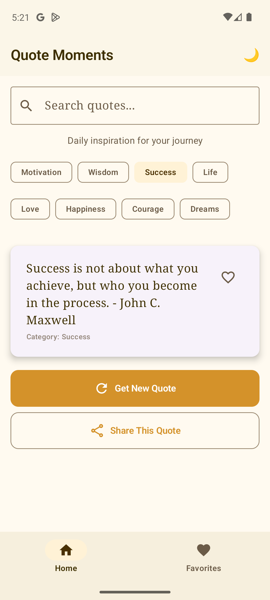
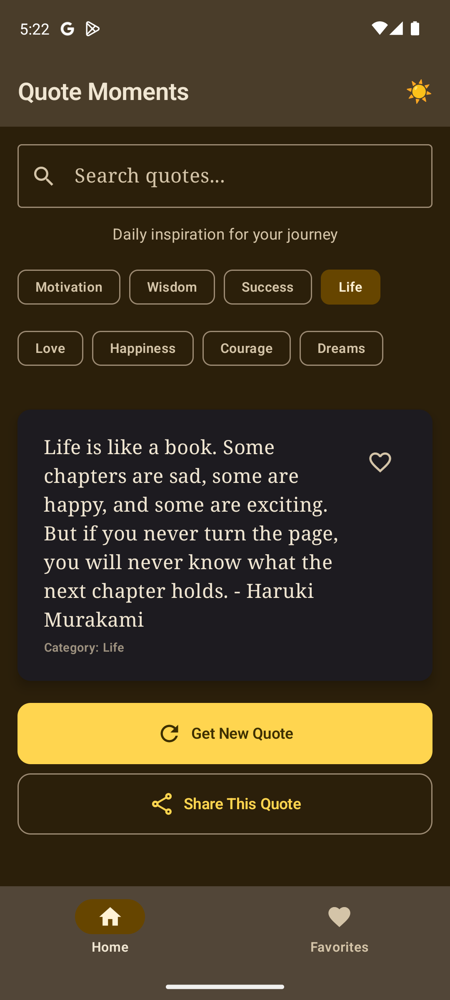
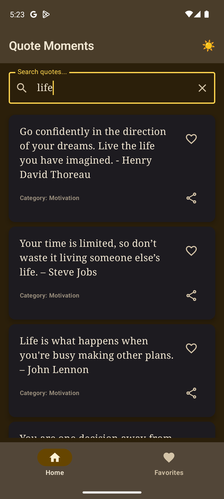
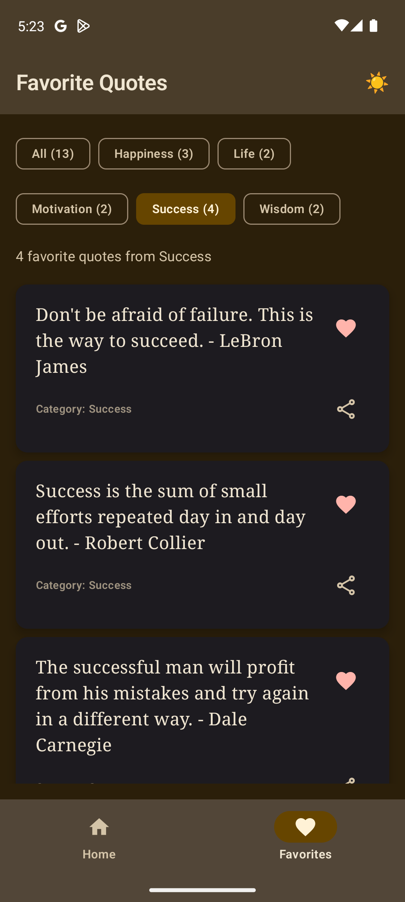

# QuoteMoments 📝✨

A beautiful and simple quotes application built with **Jetpack Compose** that provides daily inspiration through curated
quotes from various categories.

## 🌟 Features

- **Browse Quotes by Category**: Explore quotes from different categories like motivation, success, life, and more
- **Random Quote Generation**: Get a new inspiring quote with the tap of a button
- **Search Functionality**: Search through all quotes to find specific content or topics
- **Favorites System**: Save your favorite quotes for quick access later
- **Category Filtering**: Filter your favorites by category for better organization
- **Share Quotes**: Share inspiring quotes with friends and family via any messaging app
- **Dark/Light Theme**: Toggle between light and dark modes with persistent theme preference
- **Offline Support**: All quotes are stored locally in JSON format for offline access

## 📱 Screenshots

|                              Light Mode                               |                              Dark Mode                               |                              Search                               |                              Favorites                               |
|:---------------------------------------------------------------------:|:--------------------------------------------------------------------:|:-----------------------------------------------------------------:|:--------------------------------------------------------------------:|
|  |  |  |  |

## 🛠️ Tech Stack

- **UI Framework**: [Jetpack Compose](https://developer.android.com/jetpack/compose)
- **Language**: Kotlin
- **Material Design**: Material 3 with custom color scheme
- **Data Storage**:
    - JSON file in assets for quotes
    - SharedPreferences for favorites and theme preference
- **Navigation**: Bottom Navigation with two main screens

## 📁 Project Structure

```
app/src/main/
├── java/com/quotemoments/
│   ├── MainActivity.kt           # Single activity with all UI logic
│   └── ui/theme/
│       ├── Color.kt             # Custom color palette for light/dark themes
│       ├── Theme.kt             # Theme configuration
│       └── Type.kt              # Typography definitions
├── assets/
│   └── quotes.json              # Local quotes database
└── res/
    ├── AndroidManifest.xml
    └── mipmap/                  # App icons
```

## 🏗️ App Architecture

This is a simple single-activity app that demonstrates:

- **Single Activity Architecture**: Everything runs in `MainActivity` with Compose navigation
- **State Management**: Uses Compose's `remember` and `mutableStateOf` for local state
- **Data Layer**: Simple JSON file parsing with local SharedPreferences storage
- **UI Layer**: Pure Jetpack Compose with Material 3 components

### Key Components

- **HomeScreen**: Main screen for browsing quotes, categories, and search
- **FavoritesScreen**: Dedicated screen for managing favorite quotes
- **QuoteCard**: Reusable component for displaying individual quotes
- **Bottom Navigation**: Simple two-tab navigation

## 🚀 Getting Started

### Prerequisites

- Android Studio Hedgehog | 2023.1.1 or newer
- JDK 11 or higher
- Android SDK 24 (API level 24) or higher

### Installation

1. **Clone the repository**
   ```bash
   git clone https://github.com/vipulshah2010/QuoteMoments.git
   ```

2. **Open in Android Studio**
    - Launch Android Studio
    - Select "Open an existing Android Studio project"
    - Navigate to the cloned repository and open it

3. **Add your quotes** (optional)
    - Edit `app/src/main/assets/quotes.json` to add or modify quotes
    - Follow the existing JSON structure with categories and quote arrays

4. **Build and run**
    - Let Android Studio sync the project
    - Connect an Android device or start an emulator
    - Click the "Run" button or press Shift + F10

## 📄 Quotes Data Format

The app reads quotes from `assets/quotes.json` with this structure:

```json
{
  "quotes": {
    "motivation": [
      "Your quote here...",
      "Another motivational quote..."
    ],
    "success": [
      "Success quote 1...",
      "Success quote 2..."
    ],
    "life": [
      "Life wisdom quote...",
      "Another life quote..."
    ]
  }
}
```

## 🎨 Theme System

The app features a custom Material 3 theme with:

- **Custom Color Palette**: Purple-based theme with warm accents
- **Dark/Light Mode**: Full support with different color schemes
- **Persistent Theme**: User's theme choice is saved using SharedPreferences
- **Typography**: Custom typography scale using system fonts

## 🔧 Key Dependencies

```kotlin
// Core Compose dependencies
implementation 'androidx.compose.ui:ui'
implementation 'androidx.compose.material3:material3'
implementation 'androidx.activity:activity-compose'

// No external networking libraries - uses local JSON file
// No complex architecture libraries - simple Compose state management
// No database libraries - uses SharedPreferences for simple data
```

## 📱 App Features in Detail

### Home Screen

- Category-based quote browsing with filter chips
- Random quote generation from selected category
- Search functionality across all quotes
- Share quote with custom formatting
- Add/remove quotes from favorites

### Favorites Screen

- View all saved favorite quotes
- Filter favorites by category
- Category-wise count display
- Same sharing and unfavorite functionality

### Theme Toggle

- Sun/moon emoji icons for theme switching
- Immediate theme application
- Persistent storage of user preference

## 🤝 Contributing

Feel free to contribute to this project:

1. Fork the repository
2. Create a feature branch (`git checkout -b feature/new-feature`)
3. Commit your changes (`git commit -m 'Add some feature'`)
4. Push to the branch (`git push origin feature/new-feature`)
5. Open a Pull Request

## 📄 License

This project is licensed under the MIT License - see the [LICENSE](LICENSE) file for details.

## 👤 Author

**Vipul Shah**

- GitHub: [@vipulshah2010](https://github.com/vipulshah2010)

## 🙏 Acknowledgments

- Thanks to the Jetpack Compose team for the amazing UI toolkit
- Material 3 design system for beautiful components
- All the wisdom from great minds whose quotes inspire us daily

---

⭐ **If you found this project helpful, please give it a star!** ⭐

*Made with ❤️ and Jetpack Compose*